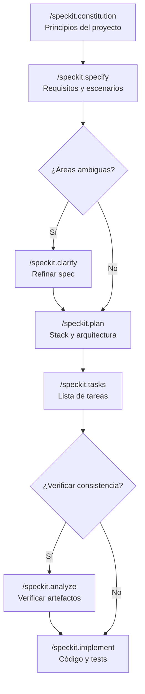
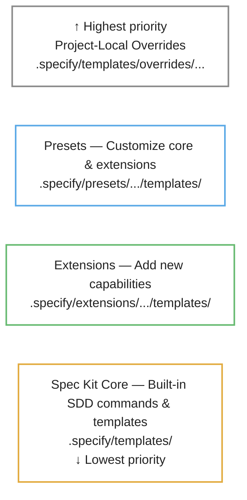

# Introducción al Desarrollo Guiado por Especificaciones

**Duración estimada**: 15 minutos

**Objetivo**: Comprender qué es SDD, la distinción entre spec y plan, y el flujo principal de Spec Kit.

## ¿Qué es GitHub Spec Kit?

GitHub Spec Kit es un **toolkit de código abierto creado por GitHub** que implementa la metodología SDD (*Spec-Driven Development*). Proporciona una CLI llamada `specify` y un conjunto de plantillas y *slash commands* para agentes de IA que guían el desarrollo desde la especificación hasta la implementación.

Su objetivo principal es **evitar el "vibe coding"**: la tendencia a generar código sin claridad sobre requisitos, criterios de aceptación o decisiones técnicas, lo que produce resultados impredecibles cuando se trabaja con agentes de IA a gran velocidad.

Spec Kit se compone de tres elementos principales:

- **CLI `specify`**: inicializa proyectos, gestiona extensiones y presets, y verifica el entorno con `specify check`.
- **Slash commands**: comandos del agente (como `/speckit.specify` o `/speckit.plan`) que guían cada fase del flujo SDD y se registran automáticamente tras `specify init`.
- **Sistema de plantillas y artefactos**: documentos Markdown versionados con Git que evolucionan junto al código y sirven como evidencia del proceso.

Spec Kit es **agnóstico del agente**: funciona con GitHub Copilot, Claude Code, Gemini CLI y otros agentes compatibles, aunque en este taller se usa con GitHub Copilot en VS Code.

## De «vibe coding» a «context engineering»

### Vibe coding: creatividad sin estructura

En febrero de 2025, el investigador de IA Andrej Karpathy acuñó el término **«vibe coding»** para describir un enfoque donde el desarrollador "*se deja llevar por la vibra*": describe lo que quiere en lenguaje natural, acepta el código que genera la IA y avanza sin especificaciones, sin plan, sin restricciones explícitas. Collins Dictionary lo nombró *Word of the Year 2025*.

El atractivo del «vibe coding» es real: **velocidad inmediata**. En minutos puedes tener un prototipo funcional, explorar ideas y experimentar con soluciones. Para proyectos desechables, ejercicios de aprendizaje o prototipos rápidos, funciona exactamente como promete.

El problema aparece cuando ese mismo enfoque se aplica a **software de producción**:

- El código generado sin contexto estructurado acumula deuda técnica compuesta
- [Estudios de GitClear](https://www.gitclear.com/ai_assistant_code_quality_2025_research) muestran que el código duplicado pasó de ~8% a ~18% de los cambios, mientras que el código refactorizado cayó de 25% a menos de 10%
- Sin especificación previa, el modelo optimiza para el contexto local sin entender convenciones del sistema
- Aparece el problema del "autor fantasma": código que nadie en el equipo entiende porque la IA lo escribió y nadie lo revisó en profundidad

### «Context engineering»: contexto intencional y estructurado

En contraposición, el **«context engineering»** es el enfoque opuesto: en lugar de improvisar prompts, se diseña y gestiona deliberadamente la información que recibe el modelo de IA para que sus respuestas sean predecibles, consistentes y alineadas con la intención del equipo.

La diferencia fundamental no es evitar las herramientas de IA, sino **usarlas de forma más efectiva** proporcionando mejores entradas y validando las salidas rigurosamente.

| | Vibe coding | Context engineering |
| :--- | :--- | :--- |
| **Enfoque** | Espontáneo, intuitivo | Metódico, orientado a sistema |
| **Contexto al modelo** | Implícito (archivos abiertos, prompt libre) | Explícito (specs, constitución, plantillas, restricciones) |
| **Resultado** | Variable, depende de la "vibra" del prompt | Predecible, trazable a requisitos |
| **Calidad** | Suficiente para prototipos | Sostenible para producción |
| **Evolución** | Difícil de mantener y refactorizar | Evoluciona con las especificaciones |

### GitHub Spec Kit como herramienta de «context engineering»

GitHub Spec Kit implementa «context engineering» de forma práctica: cada artefacto del flujo SDD (`constitution`, `spec`, `plan`, `tasks`) es una **capa de contexto intencional** que se inyecta al modelo en la fase correspondiente.

```text
 Vibe coding                          Context engineering (Spec Kit)
 ──────────────                       ──────────────────────────────
 "Hazme una API de notas"       →     constitution.md  (principios)
                                        + spec.md     (requisitos)
                                        + plan.md     (decisiones técnicas)
                                        + tasks.md    (tareas ordenadas)
                                        ─────────────────────────────
                                        = contexto rico y estructurado
                                          que guía la implementación
```

La idea clave del `README` oficial de Spec Kit lo resume:

> *"Focus on product scenarios and predictable outcomes instead of vibe coding every piece from scratch."*

Dicho de otro modo: **el «vibe coding» es generar código a partir de intención implícita; el «context engineering» es generar código a partir de intención explícita, documentada y verificable**. SDD, implementado con Spec Kit, es la metodología que formaliza este segundo enfoque.

## ¿Qué es SDD (*Spec-Driven Development*)?

El Desarrollo Guiado por Especificaciones es una metodología donde **toda implementación comienza con una especificación clara y completa**. La especificación es la fuente única de verdad para requisitos, comportamiento, interfaces y criterios de aceptación.

> **Principio fundamental**
>
> *No escribas código hasta que sepas exactamente qué debe hacer y por qué.*

## Spec vs Plan: ¿Qué/Por qué vs Cómo?

| | Spec (Especificación) | Plan (Plan de implementación) |
| :--- | :--- | :--- |
| **Pregunta** | ¿Qué construimos? ¿Por qué? | ¿Cómo lo construimos? |
| **Contenido** | Requisitos, escenarios, criterios de aceptación | Stack técnico, arquitectura, estructura de archivos |
| **Audiencia** | Stakeholders, QA, desarrolladores | Desarrolladores, arquitectos |
| **Cambios** | Cuando cambian los requisitos del negocio | Cuando cambian las decisiones técnicas |
| **Ejemplo** | "La CLI debe soportar el comando `add` que crea una tarea" | "Usar `argparse` para routing de comandos, `json` para persistencia" |

### Ejemplo concreto

**Spec** (qué/por qué):
> "TodoLite es una CLI de gestión de tareas. Debe soportar los comandos `add`, `list`, `done` y `rm`. Las tareas se persisten en un archivo JSON. El comando `list` acepta un flag `--open` para mostrar solo tareas pendientes."

**Plan** (cómo):
> "Usar Python 3.11 con `argparse` para los comandos CLI. Modelo `TodoItem` como dataclass con campos id, text, is_done, created_at_utc. Repositorio JSON con `pathlib` para I/O. Tests con `pytest`."

## Flujo principal de Spec Kit

```text
 ┌─────-────────┐    ┌──────────┐    ┌──────────┐    ┌──────────┐    ┌────────────┐
 │ constitution │───▶│ specify  │───▶│   plan   │───▶│  tasks   │───▶│ implement  │
 │              │    │          │    │          │    │          │    │            │
 │ Principios   │    │ spec.md  │    │ plan.md  │    │ tasks.md │    │ Código +   │
 │ del proyecto │    │ Qué      |    | Cómo     |    | Lista    |    | Tests      |
 |              |    | Por que  │    │          │    │          │    │            │
 └──────-───────┘    └──────────┘    └──────────┘    └──────────┘    └────────────┘
```

Cada paso produce un **artefacto** que se commitea al repositorio como evidencia del proceso.

El flujo completo, incluyendo los pasos opcionales, se puede representar así:



### Comandos del flujo principal

| Comando | Artefacto | Propósito |
| :--- | :--- | :--- |
| `/speckit.constitution` | `constitution.md` | Define principios y restricciones del proyecto |
| `/speckit.specify` | `spec.md` | Captura requisitos, escenarios y criterios de aceptación |
| `/speckit.plan` | `plan.md` | Define stack técnico, arquitectura y estrategia de testing |
| `/speckit.tasks` | `tasks.md` | Genera lista ordenada de tareas derivadas del plan |
| `/speckit.implement` | Código + tests | Ejecuta las tareas y produce código funcional |

### Pasos opcionales

Estos pasos enriquecen el flujo pero no son obligatorios:

| Comando | Propósito | Cuándo usarlo |
| :--- | :--- | :--- |
| `/speckit.clarify` | Identifica áreas sub-especificadas | Después de specify, antes de plan |
| `/speckit.checklist` | Genera checklist de verificación | Después de plan, antes de tasks |
| `/speckit.analyze` | Verifica consistencia entre artefactos | Después de tasks, antes de implement |

## Demo: Inicializar Spec Kit

Vamos a inicializar Spec Kit en un proyecto nuevo:

```bash
mkdir demo-sdd
cd demo-sdd
git init -b main
specify init --here --integration copilot --force
```

Según estés en Windows o MacOS/Linux, el asistente de configuración de Spec Kit te preguntará si los *scripts* deben ser PowerShell (`ps`) o Bash (`sh`). Elige la opción que corresponda a tu entorno.

Después de ejecutar el comando, verifica:

```bash
# Estructura creada
ls .specify/
```

**Resultado esperado**: Se crea el directorio `.specify/` con la constitución (como una plantilla vacía en este momento), plantillas base y comandos del agente registrados.

## Estructura del directorio `.specify/`

Tras ejecutar `specify init`, se crea el directorio `.specify/` con la siguiente estructura:

```text
.specify/
├── memory/
│   └── constitution.md    # Principios del proyecto (generado con /speckit.constitution)
├── templates/             # Plantillas base para spec, plan, tasks y otros artefactos
└── commands/              # Slash commands del agente registrados localmente
```

Este directorio **se versiona con Git** junto al código. Todos los miembros del equipo comparten la misma configuración de Spec Kit, plantillas personalizadas y artefactos.

## Integración con agentes de IA

Tras ejecutar `specify init`, Spec Kit registra automáticamente sus slash commands en el agente configurado. Desde ese momento el agente dispone de los siguientes comandos:

```text
/speckit.constitution   → genera constitution.md con los principios del proyecto
/speckit.specify        → genera spec.md con requisitos y escenarios
/speckit.clarify        → refina spec.md identificando áreas sub-especificadas (opcional)
/speckit.plan           → genera plan.md con stack técnico y arquitectura
/speckit.checklist      → genera checklist de verificación de calidad (opcional)
/speckit.tasks          → genera tasks.md con lista ordenada de tareas
/speckit.analyze        → verifica consistencia entre spec, plan y tasks (opcional)
/speckit.implement      → ejecuta las tareas e implementa código y tests
```

Spec Kit es completamente **agnóstico del agente**: el mismo flujo y los mismos artefactos funcionan con GitHub Copilot, Claude Code, Gemini CLI u otros agentes compatibles.

> **Tip**: si los *slash commands* no aparecen en el agente tras `specify init`, las causas más frecuentes son un `PATH` incompleto, un directorio de proyecto no detectado, o la necesidad de reiniciar el agente. Consulta la guía de *troubleshooting* del repositorio.

## Cliente, modelo y metodología: las tres capas

Para entender cómo funciona Spec Kit en la práctica, es útil distinguir las tres capas que intervienen cuando ejecutas un slash command:

```text
 ┌──────────────────────────────────────────────────────────────────┐
 │  Capa 1 — Cliente (interfaz)                                     │
 │  VS Code + GitHub Copilot Chat, Copilot CLI, Claude Code, etc.   │
 │      → Envía el prompt y recibe la respuesta del modelo          │
 └────────────────────────┬─────────────────────────────────────────┘
                          │ prompt + contexto (archivos, plantillas, instrucciones)
                          ▼
 ┌──────────────────────────────────────────────────────────────────┐
 │  Capa 2 — Modelo LLM (razonamiento)                              │
 │  Claude Sonnet 4.6, Claude Opus 4.6, GPT-5.4, Gemini, etc.       │
 │      → Interpreta las instrucciones y genera el artefacto        │
 └────────────────────────┬─────────────────────────────────────────┘
                          │ artefacto generado (spec.md, plan.md, código, etc.)
                          ▼
 ┌──────────────────────────────────────────────────────────────────┐
 │  Capa 3 — Spec Kit (metodología + estructura)                    │
 │  Plantillas, constitución, comandos, pila de resolución          │
 │      → Define qué se genera, en qué orden y con qué formato      │
 └──────────────────────────────────────────────────────────────────┘
```

- **El cliente** es la interfaz donde interactúas con el agente. En este taller usamos **VS Code con GitHub Copilot Chat**, pero también podrías usar Copilot CLI (`gh copilot`) o terminales con Claude Code o Gemini CLI.
- **El modelo LLM** es el motor de razonamiento que interpreta las instrucciones de Spec Kit y genera los artefactos. El cliente envía al modelo el contexto del proyecto (archivos abiertos, plantillas, constitución) junto con las instrucciones del slash command.
- **Spec Kit** no es un modelo ni un cliente: es la **capa de metodología** que estructura *qué* se le pide al modelo, en qué orden y con qué restricciones. Sin Spec Kit, el modelo generaría código sin una especificación previa; con Spec Kit, sigue un flujo disciplinado.

### Elección del modelo: capacidad vs velocidad

No todos los modelos producen los mismos resultados con Spec Kit. La elección del modelo afecta directamente la calidad de los artefactos generados:

| Modelo | Tipo | Fortaleza con Spec Kit | Consideraciones |
| :--- | :--- | :--- | :--- |
| Claude Opus 4.6 | Razonamiento avanzado | Excelente para specs complejas, análisis cruzado y decisiones de arquitectura | Mayor latencia y consumo de tokens |
| Claude Sonnet 4.6 | Equilibrio capacidad/velocidad | Buena opción general para todo el flujo SDD | Recomendado como modelo por defecto en el taller |
| GPT-5.4 | Propósito general | Buen rendimiento en generación de código y tareas | Rendimiento variable en análisis cruzado |

### ¿Modelos con razonamiento (*thinking*)?

Los modelos con capacidad de razonamiento (también llamados *thinking models*) dedican tokens adicionales a "pensar" antes de responder. Esto es especialmente útil en ciertas fases del flujo SDD:

- **Donde aportan más valor**: `/speckit.specify` (desambiguación de requisitos), `/speckit.analyze` (verificación cruzada entre artefactos) y `/speckit.plan` (decisiones de arquitectura con trade-offs). Estas fases requieren evaluar alternativas, detectar inconsistencias y tomar decisiones fundamentadas.
- **Donde aportan menos valor**: `/speckit.tasks` (descomposición mecánica) y `/speckit.implement` (generación de código directa). Estas fases son más secuenciales y se benefician más de velocidad que de profundidad de razonamiento.

### Modelos pensantes y los pasos opcionales de Spec Kit

Los pasos opcionales del flujo SDD (`/speckit.clarify`, `/speckit.checklist` y `/speckit.analyze`) son tareas de **revisión crítica**: buscar ambigüedades, detectar requisitos faltantes y verificar consistencia entre artefactos. Son exactamente el tipo de trabajo donde un modelo pensante marca la diferencia.

| Paso opcional | Tipo de tarea cognitiva | ¿Modelo pensante? |
| :--- | :--- | :--- |
| `/speckit.clarify` | Detectar supuestos implícitos, formular preguntas de desambiguación | Muy recomendable: requiere analizar lo que *falta* en la spec, no solo lo que dice |
| `/speckit.checklist` | Generar criterios de verificación completos | Útil: el razonamiento extendido produce checklists más exhaustivas |
| `/speckit.analyze` | Verificación cruzada spec ↔ plan ↔ tasks | Muy recomendable: debe detectar inconsistencias, dependencias rotas y requisitos no cubiertos |

Realmente no existe un patrón claro. Es algo que cada persona debe evaluar según su context, necesidades y preferencias, o dentro del marco del propio proyecto que está realizando. Por norma general, los modelos razonantes son mejores para las tareas complejas que requieren de cierto criterio, y el resto de modelos son más apropiados para tareas más mecánicas o de generación directa.

### Estrategia de modelos antagonistas

Una técnica recomendada consiste en usar **modelos diferentes para generar y para revisar**, aprovechando que cada modelo tiene sesgos y puntos ciegos distintos. La idea es que el modelo revisor actúe como un *adversario constructivo*: su objetivo no es confirmar que el artefacto está bien, sino encontrar lo que podría estar mal.

```text
 Modelo A (generador)              Modelo B (revisor antagonista)
 ────────────────────              ────────────────────────────────
  OpenAI GPT 5.4                     Claude Opus 4.6
      │                                 │
      ▼                                 ▼
 /speckit.specify → spec.md   →    /speckit.clarify → preguntas y gaps
 /speckit.plan   → plan.md    →    /speckit.analyze → inconsistencias
 /speckit.tasks  → tasks.md   →    /speckit.checklist → verificación
```

Esto funciona porque:

- **Diferentes modelos cometen diferentes errores**: un modelo puede asumir implícitamente un patrón de autenticación mientras otro lo detecta como ambiguo
- **Reduce el sesgo de confirmación**: el mismo modelo que generó un artefacto tiende a "ver" coherencia en su propia salida, incluso cuando hay problemas
- **Los pasos opcionales de Spec Kit están diseñados para esto**: `/speckit.clarify` y `/speckit.analyze` son tareas de *revisión*, no de *generación*, lo que los hace candidatos naturales para un segundo modelo

Ejemplos prácticos de combinaciones antagonistas:

| Generador | Revisor antagonista | Razón |
| :--- | :--- | :--- |
| Claude Sonnet 4.6 | Claude Opus 4.6 | El revisor con razonamiento extendido detecta inconsistencias que el generador rápido pasa por alto |
| GPT-5.4 | Claude Sonnet 4.6 | Modelos de familias distintas tienen sesgos diferentes; lo que uno asume, el otro cuestiona |
| Claude Sonnet 4.6 | GPT-5.4 | Igual que el anterior, invirtiendo roles según la fase |

No es necesario usar esta estrategia en cada proyecto. Es más útil cuando:

- La especificación es compleja o tiene muchos requisitos no funcionales
- El sistema tiene integraciones con servicios externos donde los contratos deben ser precisos
- El equipo quiere maximizar la calidad de los artefactos antes de la fase de implementación

> **Recomendación práctica para el taller**: usa un modelo con buen equilibrio entre capacidad y velocidad (como Claude Sonnet 4.6) para todo el flujo. Si necesitas mayor profundidad en la fase de especificación o análisis, cambia puntualmente a un modelo con razonamiento avanzado (como Claude Opus 4.6). Para experimentar con la estrategia antagonista, prueba a ejecutar `/speckit.clarify` o `/speckit.analyze` con un modelo diferente al que usaste para generar la spec o el plan. El cliente de GitHub Copilot permite cambiar el modelo en cualquier momento desde el selector de modelo en la ventana de chat.

## Personalización: presets y extensiones

Spec Kit permite adaptar el flujo a las necesidades de cada equipo y proyecto a través de dos mecanismos:

- **Presets**: paquetes que sobrescriben las plantillas base (`spec-template.md`, `plan-template.md`, etc.) para que los artefactos generados sigan las convenciones del equipo o proyecto. Se instalan con `specify preset add`.
- **Extensiones**: paquetes que añaden nuevos comandos (*slash commands*) al agente. Se instalan con `specify extension add` y permite extender el flujo por defecto de Spec Kit con pasos personalizados (por ejemplo, un comando para generar documentación de API o para configurar pipelines de CI/CD).

La resolución de plantillas sigue una **pila de prioridad**: overrides locales → presets → extensiones → plantillas core. Esto garantiza que las personalizaciones de mayor especificidad siempre prevalecen.



## Conceptos clave para recordar

1. **El «context engineering» sobre el «vibe coding»**: proporciona contexto explícito y estructurado al modelo en lugar de *prompts* improvisados
2. **Especificación primero**: ninguna implementación comienza sin una especificación aprobada
3. **Artefactos como evidencia**: cada paso produce un documento que se puede revisar y versionar
4. **Trazabilidad**: código, tests y commits referencian la especificación de origen
5. **Iteración**: las specs son documentos vivos que evolucionan con el sistema
6. **Personalizable**: Spec Kit se adapta a equipos con presets y extensiones
7. **Agnóstico del agente**: el mismo flujo funciona con cualquier agente de IA compatible; no hay dependencia de un proveedor específico
